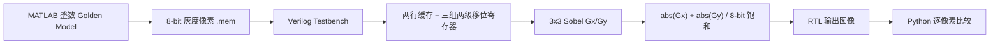
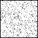

# FPGA Sobel RTL Golden Model

一个面向图像 FPGA 岗位的可复现学习项目：使用 MATLAB 建立整数 Golden Model，使用 Verilog 实现流式 3x3 Sobel 边缘检测，并在 Vivado 2020.1 XSIM 中完成逐像素一致性验证。

> 当前范围是 RTL 仿真与 Zynq-7010 核级综合检查，不包含摄像头、AXI4-Stream、Red Pitaya 上板或完整工程布局布线时序结论。

## 处理链路



## 算法定义

- 输入：8-bit 单通道灰度图，按行优先顺序输入。
- 窗口：标准 3x3 Sobel。
- 水平梯度：右列加权和减去左列加权和。
- 垂直梯度：下行加权和减去上行加权和。
- 幅值：`min(abs(Gx) + abs(Gy), 255)`。
- 边界：输出图像最外圈固定为 0。
- 流控制：`pixel_in_valid=0`时，行缓存、移位寄存器和坐标状态保持。

## RTL 结构

- `rtl/sobel_operator.v`：纯组合 Sobel 算术、绝对值和 8-bit 饱和。
- `rtl/sobel_stream_core.v`：两行缓存、3x3 滑动窗口、行列状态、边界输出和帧尾刷新。
- `tb/tb_sobel_image.v`：通过`$readmemh`输入像素，按`pixel_out_valid`保存完整输出帧。

两条行缓存提供同一列的前一行和前前一行像素；三个行数据流各使用两级横向移位寄存器保存前两列。当前输入像素作为窗口右下角，计算结果对应窗口中心位置。

## 已验证结果

在 Windows、MATLAB R2022a 与 Vivado 2020.1 环境下完成六组确定性 64x64 测试：

| 测试图 | 输出像素 | 失配数 | 最大误差 | 边界非零 |
|---|---:|---:|---:|---:|
| 常量图 | 4096 | 0 | 0 | 0 |
| 垂直台阶 | 4096 | 0 | 0 | 0 |
| 水平台阶 | 4096 | 0 | 0 | 0 |
| 单像素冲激 | 4096 | 0 | 0 | 0 |
| 结构化图案 | 4096 | 0 | 0 | 0 |
| 固定种子随机图 | 4096 | 0 | 0 | 0 |

总计比较 24,576 个像素，`mismatch=0`、`max_error=0`。完整数据见[`reports/comparison_report.csv`](reports/comparison_report.csv)。

示例结果：

| 垂直台阶 RTL | 绝对误差图 | 随机图 RTL |
|---|---|---|
|  |  |  |

绝对误差图全黑表示对应像素差值全部为 0。

面向`xc7z010clg400-1`的核级综合完成，设计综合报告为 0 error、0 warning。该结论不等同于完整 Red Pitaya 工程的布局布线或时序收敛。

## 运行方法

```powershell
& '.\scripts\run_all.ps1' `
    -VivadoBin '<Vivado-2020.1-bin>' `
    -MatlabExe '<matlab.exe>' `
    -PythonExe '<python.exe>'
```

可选核级综合检查：

```powershell
& '.\scripts\run_synth_check.ps1' `
    -VivadoBat '<Vivado-2020.1-bin>\vivado.bat'
```

生成文件位于`build/`、`testdata/`和`reports/`。详细学习步骤见[`README_CN.md`](README_CN.md)。

## 项目结构

```text
rtl/       Sobel 算术和流式窗口 RTL
tb/        图像输入与输出 Testbench
matlab/    Golden Model 和确定性测试图生成
python/    逐像素比较与误差图生成
scripts/   一键仿真和核级综合检查
reports/   精简后的验证结果
```

## 可继续扩展

1. 在 Testbench 中插入`pixel_in_valid`暂停，验证停顿恢复能力。
2. 将组合 Sobel 算术进一步流水化并同步延迟`valid`。
3. 增加 AXI4-Stream wrapper，再接入 DMA 或 Red Pitaya PS 侧缓存。


